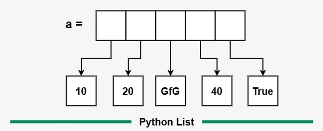

# Arrays (Lists)



## 🔹 What is a List?

* A **list** is a **data structure** that stores an **ordered collection** of elements.
* It is **mutable** → elements can be changed after creation.
* It can store **multiple data types** (e.g., integers, strings, booleans) within the same list.
* Lists are **index-based**, allowing **random access** via indices.
* Lists in Python are **dynamic** — they can grow or shrink automatically.

---

##  Creating a List

| Method                 | Syntax                | Example | Output         |
| ---------------------- | --------------------- | ------- | -------------- |
| Using square brackets  | `a = [1, 2, 3]`       | —       | `[1, 2, 3]`    |
| Using list constructor | `b = list((1, 2, 3))` | —       | `[1, 2, 3]`    |
| Repeating elements     | `c = [3] * 4`         | —       | `[3, 3, 3, 3]` |

---

##  Accessing List Elements

```python
a = [1, 2, 3, 4, 5]
a[0]      # 1 (first element)
a[-1]     # 5 (last element)
a[1:4]    # [2, 3, 4] (slicing)
```

---

##  Adding Elements to a List

| Method             | Description                      | Example                  | Result                |
| ------------------ | -------------------------------- | ------------------------ | --------------------- |
| `append(x)`        | Adds one element at the end      | `a.append(10)`           | `[10]`                |
| `extend(iterable)` | Adds multiple elements           | `a.extend([15, 20, 25])` | `[10, 15, 20, 25]`    |
| `insert(i, x)`     | Inserts element `x` at index `i` | `a.insert(0, 5)`         | `[5, 10, 15, 20, 25]` |
| `clear()`          | Removes all elements             | `a.clear()`              | `[]`                  |

---

##  Updating Elements

```python
a = [10, 20, 30, 40]
a[1] = 25
print(a)   # [10, 25, 30, 40]
```

---

##  Deleting Elements from a List

| Method      | Description                                   | Example        | Result                     |
| ----------- | --------------------------------------------- | -------------- | -------------------------- |
| `pop([i])`  | Removes element at index `i` (default = last) | `a.pop(1)`     | removes element at index 1 |
| `remove(x)` | Removes first occurrence of element `x`       | `a.remove(10)` | removes `10`               |
| `del`       | Deletes element/slice                         | `del a[0]`     | removes element at index 0 |

```python
a = [10, 20, 30, 40, 50]
a.pop()         # removes 50
a.remove(10)    # removes first 10
del a[0]        # deletes element at index 0
```

---

##  Iterating Over a List

**1. Using a loop:**

```python
for item in a:
    print(item)
```

**2. Using `enumerate()` (index + value):**

```python
for i, val in enumerate(a):
    print(i, val)
```

---

##  Nested Lists

* A list containing other lists (useful for matrices or tables).

```python
matrix = [
    [1, 2, 3],
    [4, 5, 6],
    [7, 8, 9]
]
print(matrix[1][2])  # Output: 6
```

---

##  List Comprehension

A compact way to create lists using a single line.

```python
squares = [x**2 for x in range(1, 6)]
# Output: [1, 4, 9, 16, 25]
```

---

##  How Lists Are Stored in Memory

* Python lists **store references** to objects, not the objects themselves.
* That’s why they can hold mixed types and are mutable.


```python
a = [10, 20, 'GfG', 40, True]
```

 **Note:** Mutating an element changes the reference’s target, not the structure itself.

---

##  Common Practice Problems

1.  List traversal
    You are given a list that contains integers. You need to print the elements of the list with a space between them.
    Note: Do not add a new line at the end.

Examples:

Input: arr[] = [54, 43, 2, 1, 5]
Output: 54 43 2 1 5
Explanation: Just traverse and print the numbers.
Input: arr[] = [324, 5, 2, 2]
Output: 324 5 2 2
Explanation: Just traverse and print the numbers.


2.  Length of The List
    You are given a list that contains integers. You need to return the length of the list.

Examples:

Input: arr = [54, 43, 2, 1, 5]
Output: 5
Explanation: The list contains 5 elements so its length is 5.
Input: arr = [324, 5, 2, 2]
Output: 4
Explanation: The list contains 4 elements so its length is 4. 


3. Sum the list
   You are given a list that contains integers. You need to return the sum of the list.

Examples:

Input: arr = [54, 43, 2, 1, 5]
Output: 105
Explanation: Just sum it 54 + 43 + 2 + 1 + 5 = 105.
Input: arr = [324, 5, 2, 2]
Output: 333
Explanation: Just sum it 324 + 5 + 2 + 2 = 333. 


4. Decrement list values
    You are given a list that contains integers. You need to decrement each element of the list by 1 and return the list.

Examples:

Input: arr = [54, 43, 2, 1, 5]
Output: 53 42 1 0 4
Explanation: Just decrement the numbers by 1.
Input: arr = [324, 5, 2, 2]
Output: 323 4 1 1
Explanation: Just decrement the numbers by 1.

5. Append To List
    You are given three inputs a, b, c. You need to create a list and append a, b, c to the list and then return that list.

Examples:

Input: a = 1, b = 2, c = 3
Output: 1 2 3
Explanation: Just create a list and append 1 2 3 to it. Then return [1,2,3] list.
Input: a = 4, b = 5, c = 6
Output: 4 5 6
Explanation: Just create a list and append 4 5 6 to it. Then return [4,5,6] list.


### solution


### 1️ List Traversal

**Task:** Print all elements separated by spaces.

```python
arr = [54, 43, 2, 1, 5]
print(*arr)
# Output: 54 43 2 1 5
```

---

### 2️ Length of the List

**Task:** Return the number of elements.

```python
arr = [54, 43, 2, 1, 5]
print(len(arr))   # 5
```

---

### 3️ Sum of the List

**Task:** Return the total sum of all integers in the list.

```python
arr = [54, 43, 2, 1, 5]
print(sum(arr))   # 105
```

---

### 4️ Decrement Each Value

**Task:** Decrease each element by 1.

```python
arr = [54, 43, 2, 1, 5]
arr = [x - 1 for x in arr]
print(arr)        # [53, 42, 1, 0, 4]
```

---

### 5️ append to List

**Task:** Create a list and append given values.

```python
def appendToList(a, b, c):
    lst = []
    lst.extend([a, b, c])
    return lst

print(appendToList(1, 2, 3))  # [1, 2, 3]
```

---

##  Quick Summary

| Operation          | Function   | Complexity  |
| ------------------ | ---------- | ----------- |
| Add at end         | `append()` | O(1)        |
| Add multiple       | `extend()` | O(k)        |
| Insert at position | `insert()` | O(n)        |
| Remove by index    | `pop()`    | O(1) / O(n) |
| Remove by value    | `remove()` | O(n)        |
| Access by index    | `a[i]`     | O(1)        |
| Search             | `in`       | O(n)        |
| Length             | `len(a)`   | O(1)        |

---

##  Key Takeaways

* Lists are **dynamic, heterogeneous, mutable sequences** in Python.
* Support rich operations like **slicing, iteration, nesting, and comprehension**.
* Understand their **O(1)** vs **O(n)** operations for better performance decisions.
* Common interview trick: list comprehensions and memory references.

---